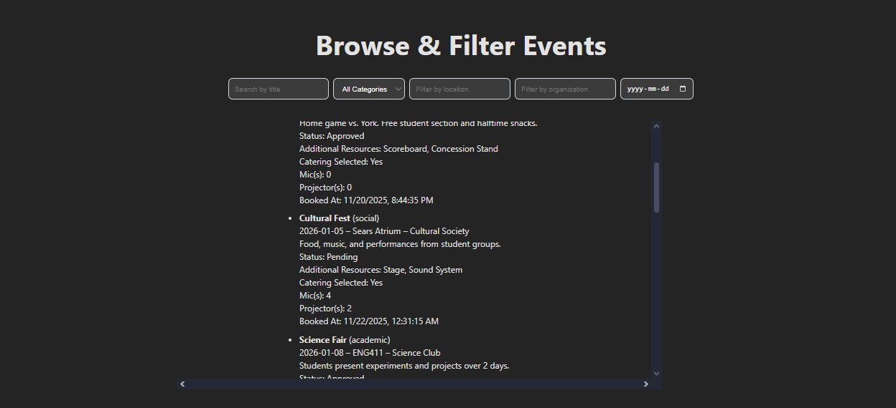
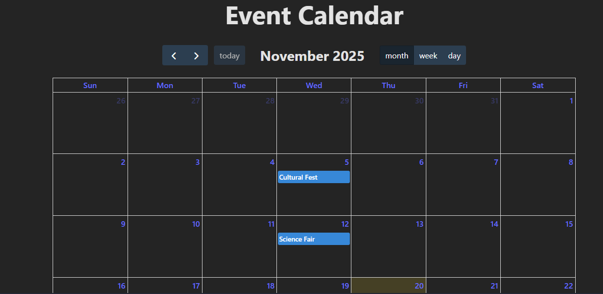

# EventDiscoveryAndPublicCalendar — User Guide

## Overview
This subproject (Event Discovery And Public Calendar) for CampusConnect helps users discover public events occuring on school, along with viewing scheduled events in an interactive calendar. This guide provides usage instructions for installation, usage, and troubleshooting techniques.

---

## Table of Contents
1. Prerequisites
2. Installation
3. Running the Application
4. Major Features
5. Troubleshooting & FAQ

---

## 1. Prerequisites
- Node.js (recommended: v22.12.0)
    - Select your distribution from the official resource: https://nodejs.org/en/download

---

## 2. Installation
1. Clone the repository with the following terminal commands:
    ```
    git clone https://github.com/anmolp476/EventDiscoveryAndPublicCalendar.git
    cd EventDiscoveryAndPublicCalendar
    ```
2. Install dependencies through npm:
    ```
    npm install
    ```
3. Build the application:
    ```
    npm run build
    ```

---

## 3. Running the Application
1. Use the following command to run the application
    ```
    npm run dev
    ```
3. Visit the provided local address to view the application in the browser
    ```
    http://localhost:3000
    ```

---

## 4. Running Tests
1. Use the following command to ensure you have installed all the necessary dependencies
```bash
npm install -D vitest @testing-library/react @testing-library/jest-dom @testing-library/dom jsdom
```
2. Run the command, `npm test`, and the test cases will run. 

---

## 4. Major Features
- Event Discovery
    - Users are presented with a minimalist user interface that provides an easy to read, yet informative overview on the events happening on campus.
    - Each entry will contain the event name and category beside it in brackets, the date and location, along with the organizing group. Below these headings, the user will find a short description of the scheduled activities.
    - The program also reports the number of resources, such as microphones and projectors. The entry is closed off with the booking time.




- Public calendar
    - The calendar provides an alternative method of visualizing upcoming CampusConnect events. 
    - Users are presented options to view activities in a month, week, or day specific view.
    - A button to jump to the current day is also given for quick access to events happening right now!



---

## 5. Troubleshooting & FAQ
**Q1: The application does not start after `npm run dev`.**  
- **Cause:** Missing or incompatible Node.js version, or dependencies not installed correctly.  
- **Solution:**  
  1. Verify your Node.js version using `node -v` (recommended: v22.12.0).  
  2. Delete `node_modules` and `package-lock.json`, then run `npm install` again.  
  3. Ensure the build succeeded with `npm run build`.

---

**Q2: The browser shows a blank page or UI issues.**  
- **Cause:** The development server may not be running properly, or cached files may cause rendering issues.  
- **Solution:**  
  1. Clear your browser cache or try an incognito/private window.  
  2. Confirm the server is running at `http://localhost:3000`.
